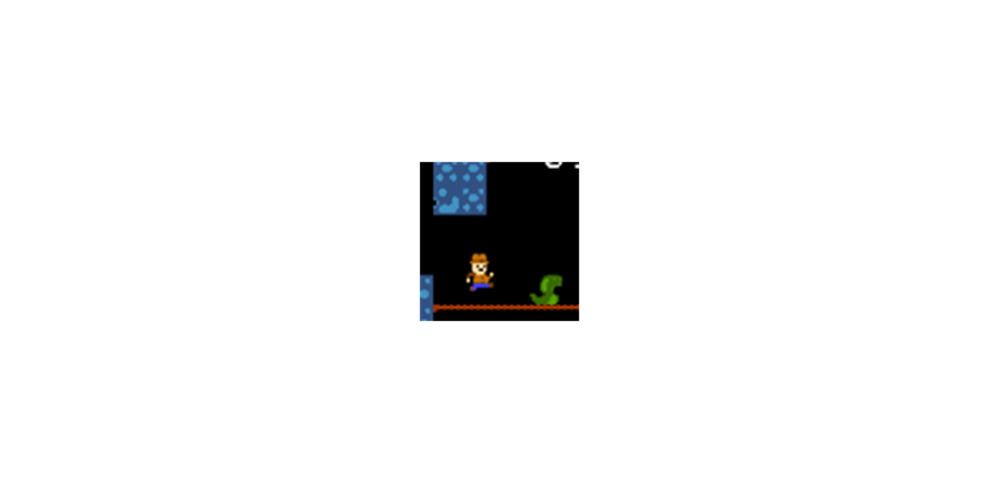

# depth-delver 1.0-prealpha

"UWP-Remake" of ITCH.io Depth Delver, fun game project. :)

## State / Status of R.E.
- Init state / Draft / Early bird (MonoGame.Extended testing + some screen-scaling bugs in LD57 lib...)

## Screenshot(s)

## My 2 cents
-  NET -> UWP
- Min. Win. SDK = 10240 

## Solution structure (architecture)
- Depth_Delver "App starter" (in general, LD57 "wrapper") & Game content (xnb)
- LD57 Kernel game lib 
- MonoGame.Extended Experimental part of project (the goal is to improve/debug this "uwp-fork 4.0.4" of famous lib) 

## ToDo
- Fix screen-scaling bugs 
- Add touchpanel support (fow old sweet win-phones/ win-tanblets/UMPCs...)

## Reference(s)
- https://superpokeunicorn.itch.io/depth-delver

## .
As is. No support. DIY. Learn purposes only.

## ..
[m][e] April 2025
