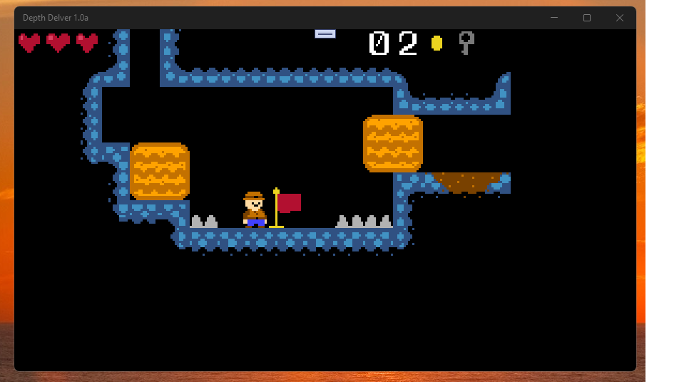

# depth-delver 1.0-alpha

"UWP-Remake" of ITCH.io Depth Delver, fun game project. :)

## State / Status of R.E.
- Early bird (MonoGame.Extended testing + some screen-scaling bugs in LD57 lib...)

## Screenshot(s)

## My 2 cents
- .NET 8 -> UWP
- Min. Win. SDK = 10240 
- Screen scaling fixed
- Touch control added (swipe up for jump, swipe left/right for move, swipe down or double swipe up for attack)
- God-mode enabled :)

## Solution structure (architecture)
- Depth_Delver "App starter" (in general, LD57 "wrapper") & Game content (xnb)
- LD57 Kernel game lib 
- MonoGame.Extended Experimental part of project (the goal is to improve/debug this "uwp-fork 4.0.4" of famous lib) 

## ToDo
- Add some cool music theme ( for brave! )))

## Reference(s)
- https://superpokeunicorn.itch.io/depth-delver

## .
As is. No support. DIY. Learn purposes only.

## ..
[m][e] April 2025
